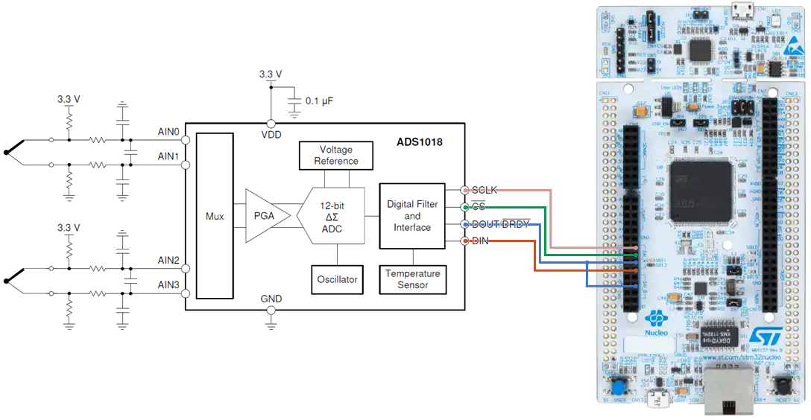
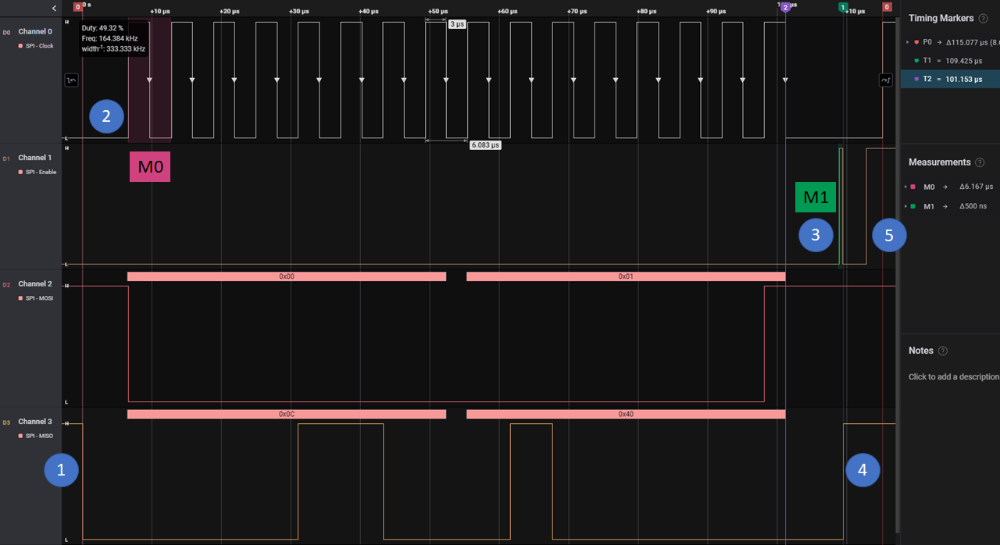

# TPFin-PComSE-Baudino

## Trabajo Práctico Final de la materia **Protocolos de Comunicación en Sistemas Embebidos**, cursada el cuarto bimestre de 2022

Alumno: **BAUDINO, Martín Sebastián**

Título del Trabajo Final: **Medición de temperatura por SPI con el ADC de bajo consumo ADS1018**


### Descripción General

El Circuito Integrado (IC) ADS1018, fabricado por Texas Instruments, es un Convertidor Analógico Digital (ADC) de 12 bits, con cuatro canales de entrada y la posibilidad de agruparlos de a pares para obtener dos entradas diferenciales. Además, cuenta con un Amplificador de Ganancia Programable (PGA) y un sensor de temperatura interno. Su principal aplicación es como interfaz de sensores de temperatura, especialmente termocuplas. Al mismo tiempo, su bajo consumo de potencia y la posibilidad de realizar un disparo único con auto apagado lo hace ideal para aplicaciones portables y su interfaz de comunicación SPI permite una sencilla conexión con cualquier tipo de microcontrolador.

Se implementa un sensor de temperatura de bajo consumo de disparo único utilizando la placa NUCLEO-F429ZI. Para ello se desarrollaron los drivers correspondientes según los requerimientos y el modelo aprendido durante el cursado de la materia, teniendo también en cuenta el código de referencia en lenguaje C que el fabricante ofrece para la familia de microcontroladores MSP432.
 
Para el desarrollo del prototipo se dispone de una placa NUCLEO-F429, un circuito impreso con un ADS1018, dos termocuplas, y un analizador lógico de bajo costo.



La conexión de las termocuplas sigue el circuito propuesto por el fabricante y las conexiones con la placa NUCLEO se realizan de la siguiente manera:

| **ADS1018**  | **NUCLEO-F429**              |
|:------------:|:----------------------------:|
| SCLK         | PIN24 - PE_2 - **SPI4_SCK**  |
| /CS          | PIN23 - PE_4 - **SPI4_CS**   |
| **DOUT**/DRY | PIN22 - PE_5 - **SPI4_MISO** | 
| DIN          | PIN19 - PE_6 - **SPI4_MOSI** |
| DOUT/**DRY** | PIN21 - **PF_8**             |

Es importante destacar que el ADS1018 pone la señal **MISO** en bajo cuando termina una conversión, con /CS en bajo y sin señal de reloj, por lo que se utiliza esta señal conectada al pin **PF_8** para que el microcontrolador solicite el dato que se acaba de adquirir.

### Driver Desarrollado

Para cumplir con los requerimientos del trabajo integrador, se creó la siguiente estructura de carpetas y archivos:

```
TPFin-PComSE-Baudino/    // Raíz del repositorio
|---ADS1018/             // Driver desarrollado
|   |---src/
|   |    |---ADS1018.c    // Funciones de alto nivel
|   |    |---port.c       // Funciones de acceso al hardware
|   |
|   |---inc/
|   |   |---ADS1018.h    // Interfaz pública del driver
|   |
|   |---docs/...         // Documentación del driver generada con Doxygen
|
|---base_proj/...        // Proyecto de ejemplo que utiliza el driver
```

El microcontrolador funciona como Maestro en la conexión SPI en Modo 1, con el reloj en bajo cuando está inactivo (CPOL=0) y muestreo de la señal de entrada en flanco negativo (CPHA=1). Además, el reloj del puerto SPI opera a 164,062 Kbit/s y el control de la señal de habilitación para el esclavo lo hace automáticamente el hardware. 

El ADS1018 está configurado para tomar 3300 muestras por segundo en modo de disparo único, por lo que luego de cada capturase pone en modo de bajo consumo, esperando un nuevo disparo.

El comportamiento implementado es del tipo polled driver, con la inclusión de una lectura bloqueante en el pin **PF_8** mientras el microcontrolador espera que el ADS1018 termine de convertir. Cada conversión toma alrededor de 400 us y se realizan tres disparos consecutivos para leer la termocupla 2, la termocupla 1 y el sensor de temperatura interno, en ese orden. El ciclo completo, incluyendo la transmisión de los datos, toma alrededor de 1,7 ms. 

* **ADS1018**: Funciones de la Interfaz de Programación de Aplicación de alto nivel del ADC ADS1018. 

```
// Inicializa el ADS1018 en modo de disparo único
bool init_ads(void);

// Dispara la conversión en los dos canales diferenciales
// del ADS1018 y espera los valores adquiridos
uint8_t read_ads(uint16_t *dataBuffer, uint8_t buffSize);
```

* **port**: Funciones de la Interfaz de bajo nivel utilizadas por la API para comunicarse con el ADS1018 a través de un puerto SPI del STM32F429ZI.
```
// Inicializa puerto SPI para comunicación con ADS1018
bool init_ads_spi(void);

// Adición ex post: convierte los canales con manejo de señales 
// de bajo nivel
uint8_t read_ads_data(uint16_t *readBuffer, uint8_t buffSize);

// Envía y recibe de a una palabra en simultáneo por SPI
uint16_t tx_rx_spi(uint16_t configWord);
```

* **Documentación**: Se utilizó el estilo Javadoc para generar documentación automática con Doxygen a partir de los comentarios de todas las constantes, variables y funciones del proyecto.

* **Proyecto de ejemplo**: La aplicación realiza mediciones de temperatura en dos termocuplas y el sensor de temperatura interno del ADS1018, comunicándose por SPI y luego retransmite estos valores a través de una interfaz UART. El microcontrolador se mantiene en modo Sleep y se despierta cada vez que se presiona el pulsador para ejecutar el ciclo de adquisición y transmisión de datos. 


### Mediciones Realizadas

En la siguiente figura se puede observar una trama completa la tercera lectura de un ciclo, correspondiente al sensor de temperatura interno, cuyos pasos más relevantes son los siguientes:

1. Con la señal de habilitación (/CS) en bajo, el ADS1018 pone en bajo la señal MISO cuando termina de realizar una medición. 
2. El microcontrolador detecta la transición [1] en su pin **PF_8** y habilita la salida de pulsos de reloj para que el ADS1018 le envíe el valor que acaba de adquirir.
3. El microcontrolador genera un pulso de más de 200ns para forzar el reinicio de la interfaz SPI del ADS1018.
4. La interfaz SPI reiniciada pone en alto la señal **MISO** indicando que no tiene un nuevo valor adquirido. En este caso no se realizarán más mediciones porque es la última del ciclo. En los otros casos esta señal estará en alto hasta que se termine de realizar una medición (Paso 1).
5. El microcontrolador pone en alto la señal /CS indicando al ADS1018 que entre en modo de bajo consumo.




