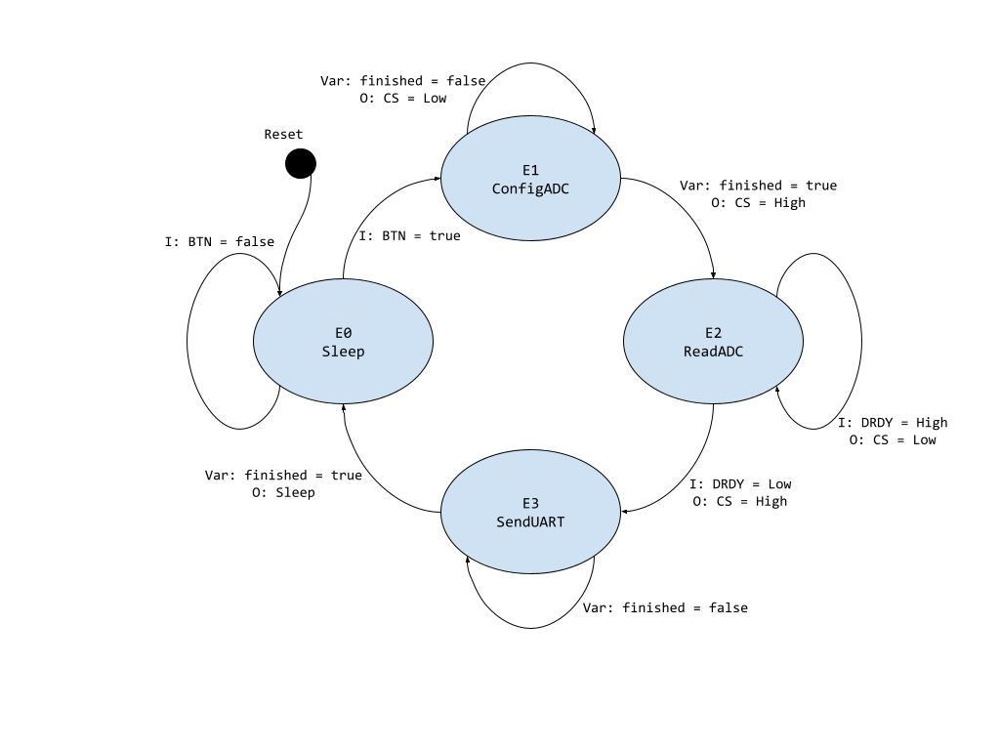

# TPFin-PComSE-Baudino

## Trabajo Final de las materias **Protocolos de Comunicación en Sistemas Embebidos** y **Programación de Microprocesadores**, cursada el cuarto bimestre de 2022

Alumno: **BAUDINO, Martín Sebastián**
Plataforma embebida: **NUCLEO-F429ZI**
Aplicación: **Sensor de temperatura de bajo consumo**

La aplicación realizará mediciones de temperatura en dos termocuplas, comunicándose por SPI con el ADC de bajo consumo ADS1018 y luego retransmitirá estos valores a través de una interfaz UART. El microcontrolador se mantendrá en modo Sleep y ejecutará el ciclo de adquisición y transmisión de datos cada vez que se presione el pulsador.
Periféricos (1 ó 2): SPI, UART, GPIO

## Diagrama de estado de MEF con una breve descripción de cada estado


* E0 - Sleep: Tanto el microcontrolador como el ADS1018 se encuentran en modo de bajo consumo, con todas sus salidas apagadas.
* E1 - ConfigADC:  El microcontrolador envía por SPI los bytes de configuración al ASD1018, esto dispara la conversión analógica a digital en ambos canales.
* E2 - ReadADC: El microcontrolador espera que se haya terminado la conversión para solicitar los valores adquiridos por SPI al ADS1018. 
* E3 - SendUART: El microcontrolador envía los datos leídos por UART a la PC.

## Módulos de software implementados para cada periférico

* **sensorApp**: Aplicación principal que realizará el procesamiento de los datos a través de una Máquina de Estados Finitos. 

```
// Definiciones de estados válidos
typedef enum {
    E0Sleep, 
    E1ConfigADC, 
    E2ReadADC,
    E3SendUart
} sens_fsm_state;

// Inicializa variable privada del estado en *E0Sleep*
bool init_sens_fsm(void);

// Corre la MEF actualizando estados cuando corresponde
void update_sens_fsm(void);
```

* **ADS1018**: Funciones de la Interfaz de Programación de Aplicación de alto nivel del ADC ADS1018. 

```
// Inicializa el ADS1018 en modo de disparo único
bool init_ads(void);

// Dispara la conversión en los dos canales diferenciales
// del ADS1018 y espera los valores adquiridos
uint8_t read_ads(uint16_t *dataBuffer, uint8_t buffSize);
```

* **ADS1018_bsp**: Funciones de la Interfaz de bajo nivel utilizadas por la API para comunicarse con el ADS1018 a través de un puerto SPI del STM32F429ZI.
```
// Inicializa puerto SPI para comunicación con ADS1018
bool init_ads_spi(void);

// Adición ex post: convierte los canales con manejo de señales 
// de bajo nivel
uint8_t read_ads_data(uint16_t *readBuffer, uint8_t buffSize);

// Envía y recibe de a una palabra en simultáneo por SPI
uint16_t tx_rx_spi(uint16_t configWord);
```

* **sens_comm**: Funciones de la Interfaz de Programación de Aplicación de alto nivel para la transmisión de datos.
```
// Inicializa una interfaz de comunicación de manera 
// transparente a la aplicación
bool init_comm(void);

// Transmite cadenas de caracteres terminadas en '\0'
bool tx_data(uint8_t *dataBuffer);

// Recibe cadenas de caracteres de tamaño definido
bool rx_data(uint8_t *dataBuffer, uint8_t buffSize);
```

* **comm_bsp**: Funciones de la Interfaz de bajo nivel utilizadas por la API para comunicarse con la PC a través de un puerto UART del STM32F429ZI.

```
// Inicializa puerto UART para comunicación con PC
bool init_uart(void);

// Envía cadenas de caracteres de tamaño específico por UART
bool tx_uart(uint8_t *dataBuffer, uint8_t buffSize);

// Recibe cadenas de caracteres de tamaño específico por UART
bool rx_uart(uint8_t *dataBuffer, uint8_t buffSize);
```


